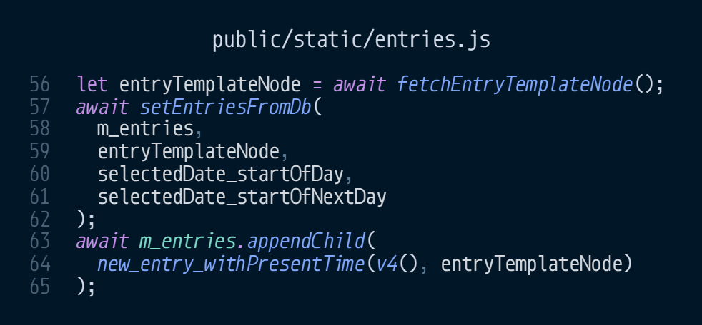
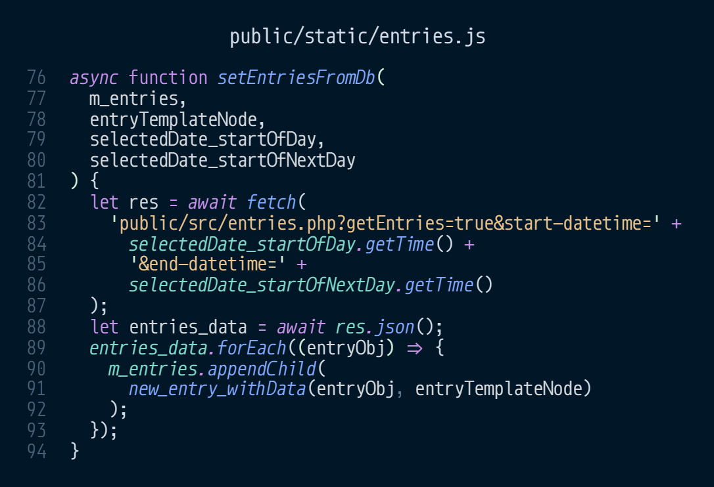
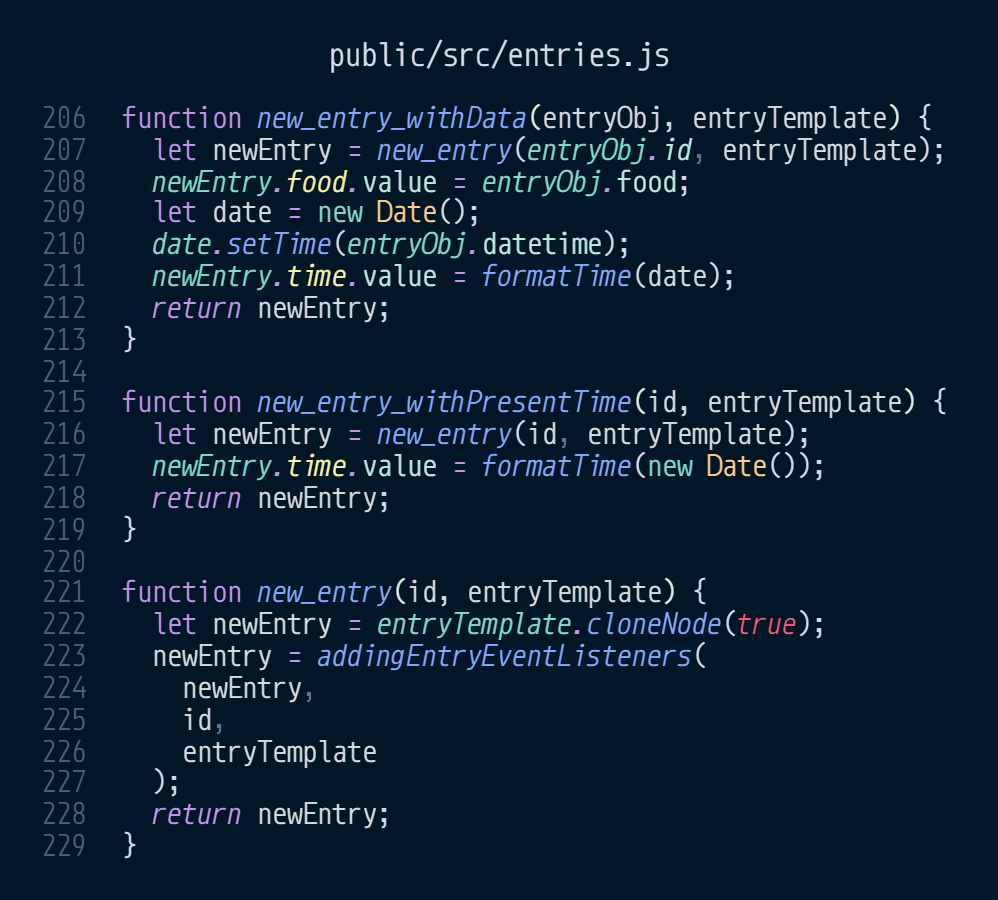
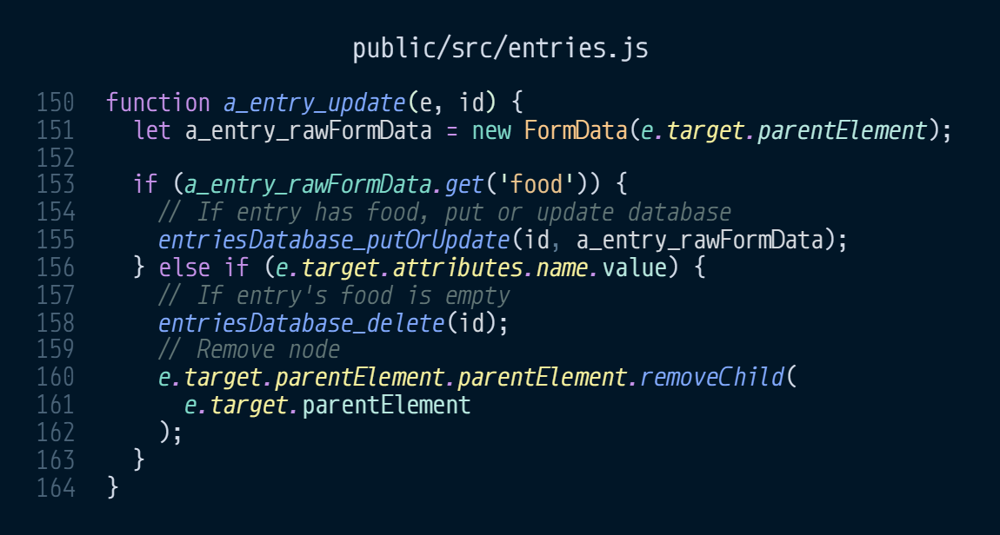
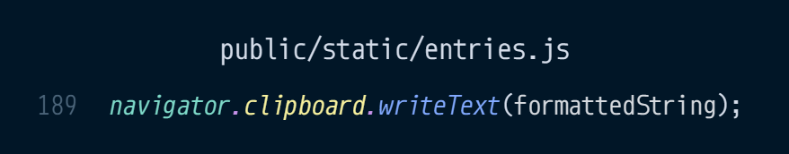

avalli
=

Din personliga matjournal och matlista
 

  

# Languages

### [English](../../README.md) Swedish
#### Swedish is the primary language of the docs

  

# Kod

Första steget in i applicationen. Nu skapas template objektet
vilket används för att lägga till titel och den view som ska
visas. Här skickas "entries.html" ut till klienten. 
 

---

I header:n är en datumväljare som väljer vilken dags food entries som ska visas. Dessa läggs som egna html formulär i "m_entries" utifrån "entry.html" mallen. 
 

---

Denna view används som en mall för alla entries. 
 

---

"entries.js" körs av "entries.html" vilken direkt vid onload hämtar "entry.html" genom att skicka en GET fetch request till "views.php". 
 

---

Här används den hämtade entry noden till att rendera tidigare skapade entries, som ligger i databasen. De entries med datumstämpel inom den tid som är vald av datum väljaren hämtas och renderas, samt en ny entry med nuvarande tid. Denna får även ett id, skapat av npm:s uuid, v4 funktionen används. 
 

---

Här görs en ny GET fetch request som frågar efter alla entries inom spannet av valt datum. Dessa renderas sedan genom "new_entry_withData". 
 

---

Där ligger tre "new_entry" functioner. En som endast skapar en ny nod ifrån noden av "entry.html" genom att klona den. De andra två  använder denna grund funktion för att skapa sin nya entry. Dessa två lägger sedan till nuvarande tid eller förbestämd data. 
 

---

Här är det event som varje entry har för att vid förändring av mat eller tid skicka till databasen. Har en entry fått ny data när den tappar fokus då skickas datan till "entries.php". Finns id:et i databasen ändras innehållet, annars skapas en ny. Är mat fältet tomt i denna entry då raderas den både från databasen och visuellt, html noden tas bort. 
 

---

 

---
  

# Problem ärenden
https://github.com/davlin0222/avalli/issues

---

 

## Extra beylsta befintiliga problem

Denna rad används vid exportering genom att kopiera den formaterade strängen till användarens clipboard. Detta har upptäckts inte fungera på DuckDuckGo:s och Safari:s mobila webbläsare. 
https://github.com/davlin0222/avalli/issues/4
  

Ändrar man tiden på en entry, innan mat lagts till, tas den bort. 
https://github.com/davlin0222/avalli/issues/5

 

---

  

## Använder
### Språk

- PHP på backend
- JSON för databas
- HTML markup på framsidan
- JavaScript, frontend, gör förfrågningar till backend
- scss -> css, för styling
  - Tillämpar egen modifierad atom-bem class naming

### Software
- Apache server

### Dependencies
- npm
  - uuid