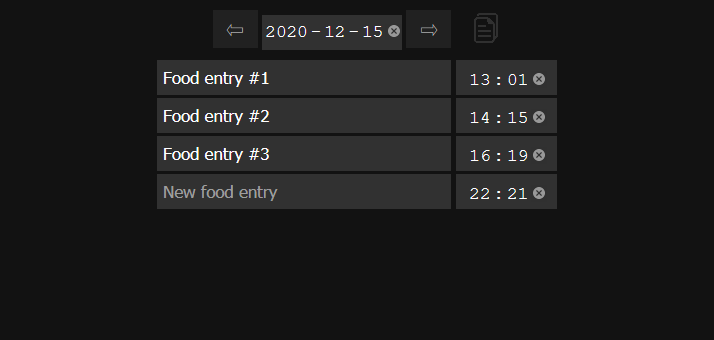
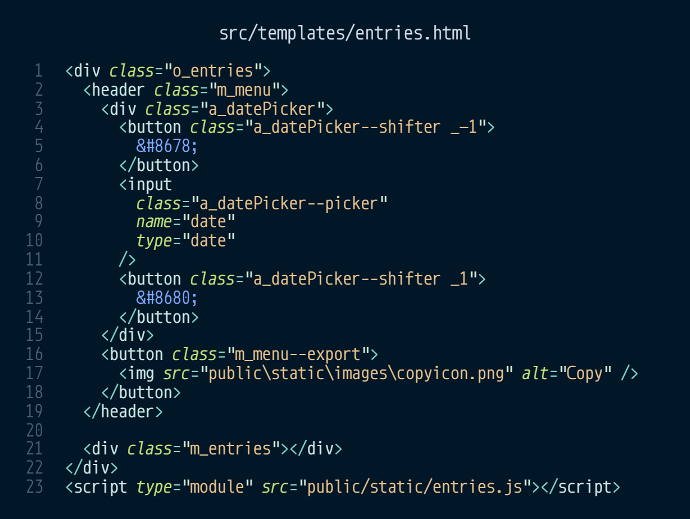
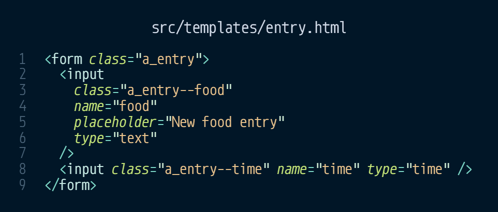
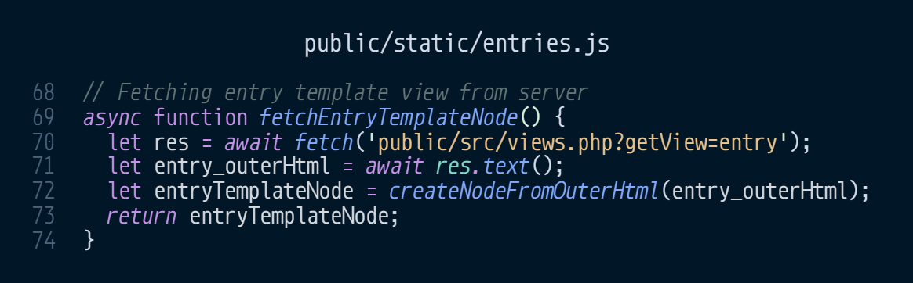
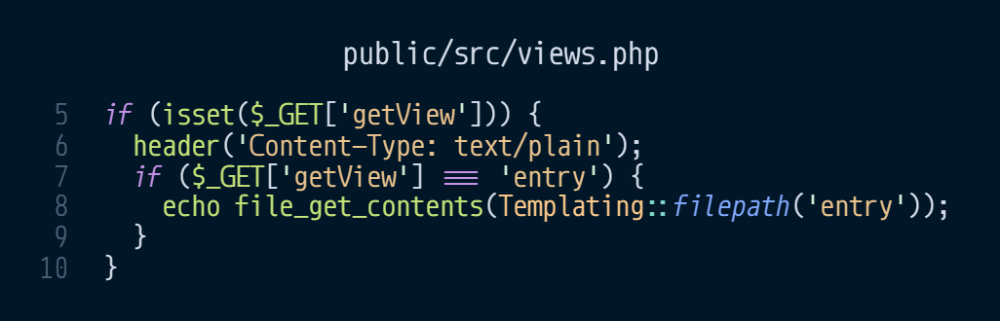

avalli
=

Din personliga matjournal och matlista
 

 
 

# Languages

### [English](../../README.md) Swedish
#### Swedish is the primary language of the docs

 
 

# Kod

Första steget in i applicationen. Här skapas template objektet
vilket används för att lägga till titel och vilken view som ska
visas. Nu skickas entries.html ut till klienten.

---

En datumväljare som väljer vilka food entries som ska visas. Dessa
entries läggs i m_entries som ett utifrån entry.html

---

Denna vy hämtas genom fetch i entries.js som körs av entries.html

---

Här hämtas entries.html

---

 
 

## Använder

### Språk

- PHP
- JSON
- HTML
- JavaScript
- scss -> css

##### Egen modifierad atom-bem scss
