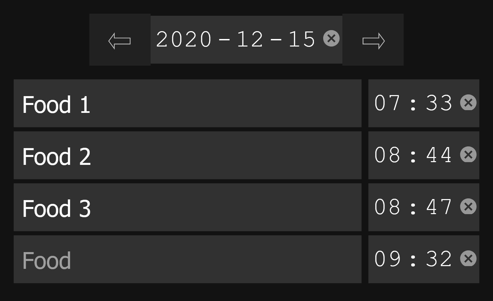

# avalli
Din personliga mat dagbok och mat journal

## Languages
[English](../../README.md) Swedish

## Kod 

Första steget in i applicationen. Här skapas template objektet vilket används för att lägga till titel och vilken view som ska visas. Nu skickas entries.html ut till klienten.

